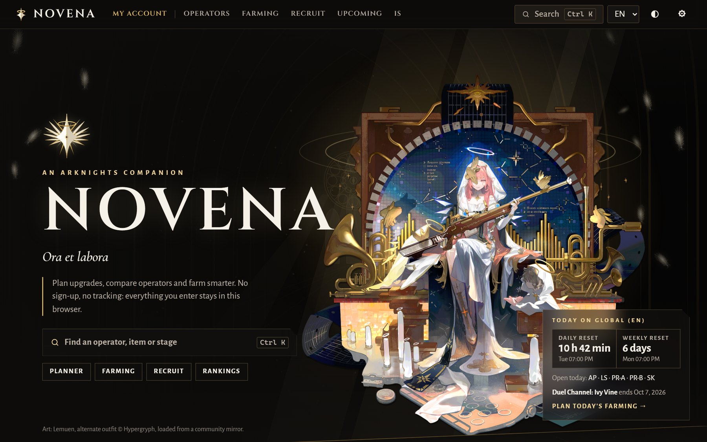
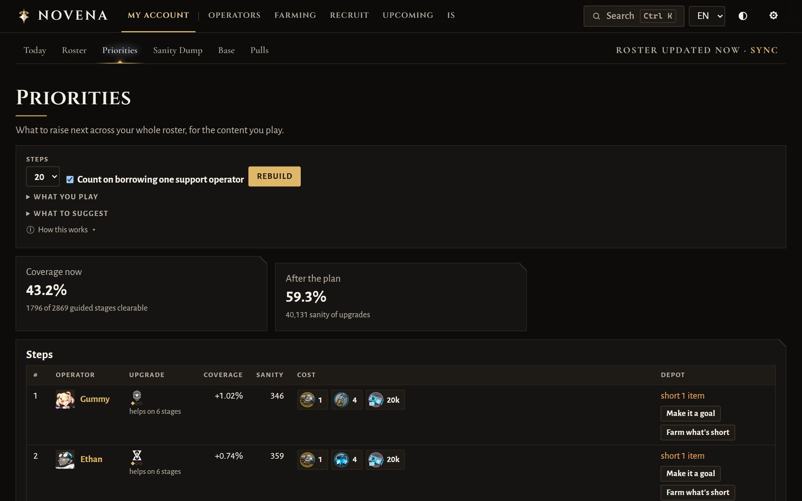
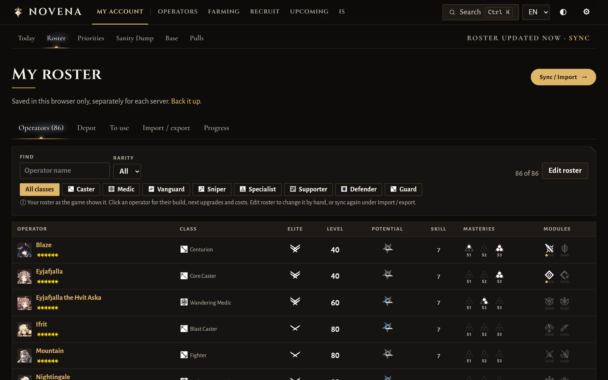
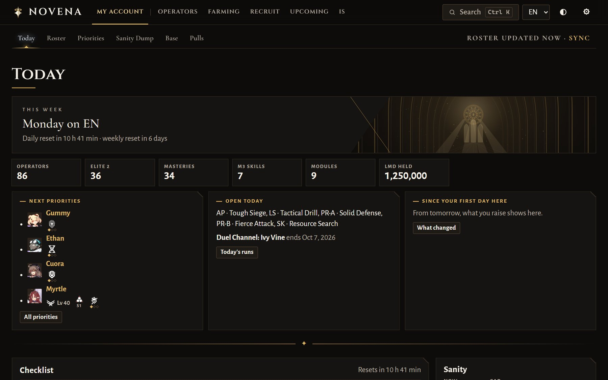
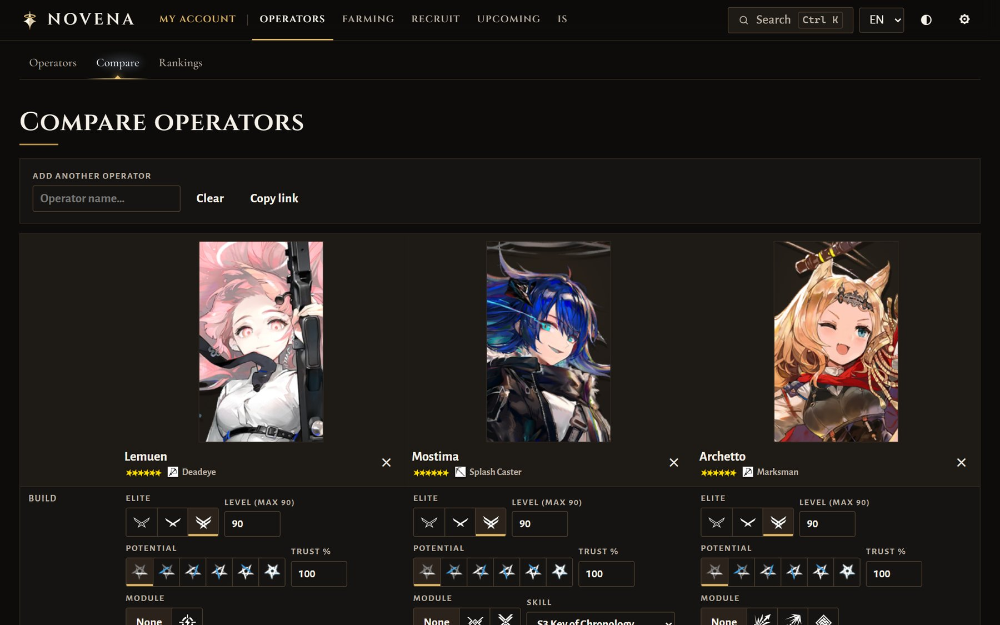

# Novena

A free, open-source companion for **Arknights**: operator database, side-by-side comparison, upgrade and farming
planners, recruitment calculator, community rankings, and a look at what's coming from CN. For every server
(Global/EN, JP, KR, CN). **No sign-up, no tracking; your data stays in your browser.**

**Site:** https://vanastraea.github.io/novena/ · **Feedback:** [open an issue](../../issues)



| Priorities: what to raise next | Your roster, with the game's icons |
|---|---|
|  |  |
| **Today: your account at a glance** | **Compare operators** |
|  |  |

<sub>Screenshots use the made-up sample roster.</sub>

## What it does

Useful without any account data:

- **Operator database.** Every operator, searchable and filterable by class, branch, rarity, faction, how to get
  them and server. Each page has stats at any elite/level/potential/trust with module bonuses, every skill level and
  mastery with ranges drawn as grids, talents, modules stage by stage, base skills, every upgrade's materials and LMD,
  recruitment tags, alter forms, and community data: how often clear guides use the operator per content type, the
  build the community converges on, and *lift* (used more than its ownership rate suggests).
- **Compare** 2–4 operators side by side, each at its own build: stats, skills at the chosen mastery, talents and
  module effects, the cost of reaching each build (materials, LMD and a sanity-equivalent), and community usage.
  The best value in each row is marked. Every comparison is a shareable link.
- **Upgrade planner.** Type builds like `Saria E2 L90, S2 M3, Mod X2` (or pick them), get the total materials,
  LMD and EXP, what to craft from lower tiers, and what your depot already covers.
- **Farming planner.** The cheapest stage runs for what you're missing (a linear program over Penguin Statistics
  drop rates, solved in your browser), stages open today and this week, reset times in your local time, a
  day-by-day schedule, and a list of stages to leave out (ones you haven't cleared yet).
- **Recruitment calculator.** Pick your five tags; see every combination with its guaranteed rarity and the
  operators it can give. With Novena Sync, your four slots' tags are there to check in one click.
- **Rankings.** Usage in community clears per content type and archetype.
- **Gaps.** The archetypes community clears lean on that your roster covers poorly, who you have in each, and the
  quickest ways to fill them: raise one you own to its community build (one click makes it a Planner goal) or get one.
- **Upcoming content.** Events, operators, modules and banners CN has had and your server hasn't, with estimated
  dates from the measured CN→server lag, the operators each event's guides use most, and the next Contingency Contract.
  Names Global hasn't announced get an unofficial English translation, marked as such, until the official one lands.
- **Event shop advisor.** Each running or coming event's shop (Yituliu's record of CN's shops), every offer valued in
  sanity per token, and how many of each would cover what your plan is short of.
- **Integrated Strategies.** Per theme, the operators that carry runs.

With your roster (typed in, imported, or a made-up sample roster to try things first):

- **Roster** shown with the game's own elite, potential, mastery and module icons; an edit mode for changing it by
  hand; depot, import/export (this site's files, Novena Sync, raw syncData, Krooster profiles, depot exports from Krooster and Penguin Statistics) and progress over time.
- **Novena Sync (optional desktop app):** signs in to your account on your own computer and hands the site your
  roster with one click: operators and their outfits, depot, recruitment slots, your base and sanity. See
  [`sync/README.md`](sync/README.md) and the [releases](../../releases).
- **Depot from screenshots:** take screenshots of your in-game Depot, drop or paste them in, check what was read,
  apply. They're read on your device and never uploaded, and nothing touches the game.
- **Priorities:** the upgrades that unlock the most community clears per sanity, your planner targets first, with a
  "doable now" check against your depot counted all together. Built by itself after an import or sync; each step can
  become a goal or open the farming plan for what it's short of. Leave out operators you don't want to raise, one at
  a time or several at once, or whole rarities. The top three also show on Home and Today.
- **Sanity Dump:** what today's sanity should go into, aimed at the materials you hold least against what your plan
  and your strongest operators' community builds need.
- **Today:** your account at a glance, a sanity timer, timers from your last sync (recruitment, factories, drones)
  with optional notifications, and the day's routine as a checklist with ticks that clear at the reset.
- **Base (RIIC) optimizer:** best team per room over a 1–3 shift rotation, how long each team lasts on its morale, a
  dorm plan for who rests where (default morale numbers), and your fastest trainer per class and mastery plus the
  Workshop's best byproduct operators. With Novena Sync, your base as it is now: rooms, teams, morale and production.
- **Progress with costs:** what you raised since an earlier day and exactly what it cost (materials, LMD, EXP).
- **Items to use:** training vouchers with the five operators each is best spent on, potential tokens and whose
  potential they raise, and items that expire soonest.
- **Pull planner:** savings, steady income and the banners coming.

## Privacy

- Everything you enter is saved in your browser (local storage and IndexedDB) and nowhere else. Export and import a single JSON backup
  from Settings.
- No accounts, no analytics, no tracking, no cookies. The site never asks for a Yostar or game login.
- The site reads only its own static data files (built once a day) and images from a community art mirror.
- The website never logs in to your game account. The roster is typed in or imported from a file, and the depot can
  come from screenshots you take. If you choose to, the separate **Novena Sync** app signs in on your own computer
  (unofficially, at your own risk) and hands the site a cut-down copy over `127.0.0.1`: operators and the outfits
  they wear, depot and currencies, consumables, recruitment slots, base rooms and teams, and sanity. Never names, ids,
  friends or messages ([the exact list](sync/novena_sync/payload.py)).
- Notifications (sanity, recruitment, drones) are the browser's own, scheduled by the open page; nothing is sent.
- Depot screenshots are read in your browser and never uploaded.
- No automation of any kind: nothing here, Novena Sync included, drives the game client.

## Data sources and credits

A GitHub Actions job fetches each source **once a day**, processes it and publishes static JSON; browsers never call
these services. Thank you to everyone who runs and contributes to them.

| Source | Used for | License / terms |
|---|---|---|
| [ArknightsAssets/ArknightsGamedata](https://github.com/ArknightsAssets/ArknightsGamedata) | Game tables for all servers | Game data © Hypergryph / Yostar |
| [Penguin Statistics](https://penguin-stats.io/) | Drop rates per server | [CC BY-NC 4.0](https://developer.penguin-stats.io/public-api/) |
| [Yituliu](https://ark.yituliu.cn/) | Material values; operator investment survey (~100k CN accounts); CN event shops | Used with credit |
| [MAA Copilot guide database](https://prts.plus/) | Community clear guides, read only to count usage for Rankings, Upcoming and the Plan (no guide is republished) | Community-submitted |
| [MAA resource files](https://github.com/MaaAssistantArknights/MaaAssistantArknights) | Base skill values and combinations, IS recruit priorities, as data (Novena doesn't use the MAA program) | AGPL-3.0; processed copies are published with the site |
| [ArknightsGameResource](https://github.com/yuanyan3060/ArknightsGameResource) | Operator portraits, splash and outfit art, skill, item and base-skill icons (loaded, not bundled) | Art © Hypergryph / Yostar |
| [ArknightsAssets2](https://github.com/ArknightsAssets/ArknightsAssets2) | The game's UI icons (classes, branches, elite, potential, mastery, rarity, modules) and story backgrounds (loaded, not bundled) | Art © Hypergryph / Yostar |
| [Arknights Toolbox depot recognition](https://github.com/arkntools/depot-recognition) | Reading depot screenshots in the browser (bundled library) | MIT |

Every bundled package and font with its license is listed on the site's **Credits** page, generated at build time by
[`scripts/licenses.mjs`](scripts/licenses.mjs) (also as [`public/THIRD_PARTY_NOTICES.txt`](public/THIRD_PARTY_NOTICES.txt)). Fonts: Alegreya Sans,
Cinzel and Cormorant Garamond, all SIL Open Font License.

Both usage sources are CN, which runs months ahead: rankings hold, but percentages read lower than they will once
your server catches up. Derived numbers are labelled as estimates where they appear.

**Unofficial fan tool. Not affiliated with Hypergryph, Yostar or Gryphline. Arknights and all game assets belong to
their owners.** Code: [MIT](LICENSE).

## How it's built

- **Front end:** Preact + TypeScript + Vite, a static single-page app on GitHub Pages. Every view has a shareable URL.
- **Data pipeline:** Python (standard library only) in [`pipeline/`](pipeline), run daily by
  [`.github/workflows/deploy.yml`](.github/workflows/deploy.yml). It writes versioned JSON under `/data/v1/`.
- **In-browser compute:** the farming LP runs in [HiGHS](https://highs.dev/) compiled to WebAssembly
  ([highs-js](https://github.com/lovasoa/highs-js)); costs, crafting, recruitment and the guide-coverage planner are
  TypeScript (the planner in a Web Worker).
- It grew out of a private tool, *ako*; [`PORTING.md`](PORTING.md) says what was ported and what was left out.

## Run it locally

Needs Node 20+ and Python 3.11+.

```bash
npm install
npm run data        # downloads game tables and community data into .cache/, builds public/data/v1 (a few minutes)
npm run dev         # http://localhost:5173
```

`npm run data -- --servers en` builds one server; `npm run data:offline` rebuilds from the cache without
downloading anything.

Tests:

```bash
npm test                              # unit + golden tests (TypeScript ports vs. the original Python)
cd pipeline && python -m pytest -q    # pipeline tests
npm run build && npm run smoke        # Playwright smoke test of the built site, phone and desktop
```

## Contributing

Issues and pull requests are welcome, especially wrong numbers (with the operator and server), translations of the UI,
and accessibility problems. Please keep the ground rules: no game automation, no server-side accounts or credentials,
user data stays in the browser, and community sources are fetched only by the daily pipeline.

## Screenshots

The images at the top come from `scripts/screenshots.mjs`, which uses the made-up sample roster (never a real
account): run `npm run dev`, then `node scripts/screenshots.mjs`. It also takes `upcoming.jpg` and `phone.jpg`
for announcements.
